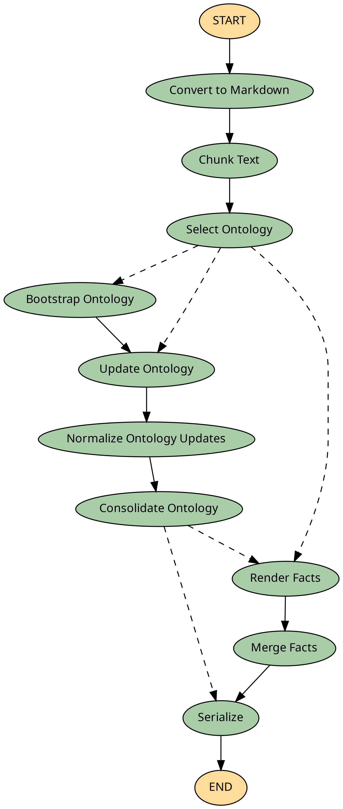

# OntoCast 

### Agentic ontology-assisted framework for semantic triple extraction

 
[](https://badge.fury.io/py/ontocast)
[](https://pepy.tech/projects/ontocast)
[](https://opensource.org/licenses/Apache-2.0)
[](https://github.com/growgraph/ontocast/actions/workflows/pre-commit.yml)
[](https://doi.org/10.5281/zenodo.17796467)

---

## Overview

OntoCast is a framework for extracting semantic triples (creating a Knowledge Graph) from documents using an agentic, ontology-driven approach. It combines ontology management, natural language processing, and knowledge graph serialization to turn unstructured text into structured, queryable data.

---

## Key Features

- **Ontology-Guided Extraction**: Ensures semantic consistency and co-evolves ontologies
- **Entity Disambiguation**: Resolves references across document chunks (embedding + symbolic alignment)
- **Parallel Processing**: Per-unit ontology and facts loops with configurable worker concurrency
- **Multi-Format Support**: Handles text, JSON, PDF, and Markdown
- **Semantic Chunking**: Splits text based on semantic similarity
- **RDF Output**: Produces standardized RDF/Turtle (optional JSON-LD LLM wire format)
- **RDF 1.2 Provenance**: Quoted-triple / reification support; optional `strip_provenance` on API output
- **Triple Store Integration**: Apache Fuseki (production) or in-memory pyoxigraph (default)
- **Ontology Context Modes**: Catalog selection, Qdrant vector retrieval, or fixed catalog ontology
- **Tenancy**: Partition Fuseki datasets and Qdrant collections by tenant and project
- **REST API**: Document processing, ontology catalog management, and graph-matching endpoints
- **Hierarchical Configuration**: Type-safe configuration system with environment variable support
- **Automatic LLM Caching**: Built-in response caching for improved performance and cost reduction
- **GraphUpdate Operations**: Token-efficient SPARQL-based updates instead of full graph regeneration
- **Budget Tracking**: Comprehensive tracking of LLM usage and triple generation metrics
- **Ontology Versioning**: Automatic semantic versioning with hash-based lineage tracking

---

## Applications

OntoCast can be used for:

- **Knowledge Graph Construction**: Build domain-specific or general-purpose knowledge graphs from documents
- **Semantic Search**: Power search and retrieval with structured triples
- **GraphRAG**: Enable retrieval-augmented generation over knowledge graphs (e.g., with LLMs)
- **Ontology Management**: Automate ontology creation, validation, and refinement
- **Data Integration**: Unify data from diverse sources into a semantic graph

---

## Installation

```sh
uv add ontocast[doc-processing] 
# or
pip install ontocast
```

### Optional features: document processing (PDFs, PPT, OCR, semantic chunking):

```sh
uv add "ontocast[doc-processing]"
# or
pip install "ontocast[doc-processing]"
```

---

## Quick Start

### 1. Configuration

Copy the example file and edit as needed:

```bash
cp .env.example .env
```

Minimal settings:

```bash
# LLM Configuration
LLM_PROVIDER=openai
LLM_API_KEY=your-api-key-here
LLM_MODEL_NAME=gpt-4o-mini
LLM_TEMPERATURE=0.0

# Server Configuration
PORT=8999
BASE_RECURSION_LIMIT=1000
ESTIMATED_CHUNKS=30
MAX_VISITS=1
RENDER_MODE=ontology_and_facts
ONTOLOGY_MAX_TRIPLES=50000

# Path Configuration
ONTOCAST_WORKING_DIRECTORY=/path/to/working
ONTOCAST_ONTOLOGY_DIRECTORY=/path/to/ontologies
ONTOCAST_CACHE_DIR=/path/to/cache

# Optional: Triple Store Configuration (Fuseki for production persistence)
FUSEKI_URI=http://localhost:3030
FUSEKI_AUTH=admin/admin
# Datasets default to ontocast--test--facts / ontocast--test--ontologies when unset

# Optional: Web search grounding (search-later mode)
WEB_SEARCH_ENABLED=false
WEB_SEARCH_PROVIDER=duckduckgo
WEB_SEARCH_TOP_K=3
```

See [Configuration Guide](docs/user_guide/configuration.md) and `.env.example` for the full surface (embeddings, Qdrant, aggregation, etc.).

### 2. Start Server

```bash
# Backend automatically detected from .env configuration
ontocast --env-path .env

# Process a specific file (batch mode)
ontocast --env-path .env --input-path ./document.pdf

# Process only the first N chunks (for testing)
ontocast --env-path .env --head-chunks 5
```

Paths and triple-store credentials are configured via `.env` — not CLI overrides.

### 3. Process Documents

```bash
curl -X POST http://localhost:8999/process -F "file=@document.pdf"
```

JSON body example:

```bash
curl -X POST http://localhost:8999/process \
  -H "Content-Type: application/json" \
  -d '{"text": "Your document text here"}'
```

### 4. API Endpoints

The OntoCast server exposes a REST API. Common endpoints:

- **POST /process** — full document pipeline (JSON or multipart file upload)
- **POST /process_unit** — single-unit pipeline (useful for debugging prompts)
- **POST /ontologies** — upload catalog ontologies (Turtle)
- **POST /flush** — flush/clean triple store data
- **GET /health**, **GET /info** — health and service metadata
- **POST /match/entities** (and related match routes) — entity alignment and evaluation

```bash
curl -X POST http://localhost:8999/process -F "file=@document.pdf"

curl -X POST http://localhost:8999/flush

curl -X POST "http://localhost:8999/flush?dataset=my_dataset"
```

For Fuseki, optional `tenant`/`project` query parameters target a specific partition. Without them, the active server scope is flushed.

Full reference: [API Endpoints](docs/user_guide/api.md).

---

## Workflow

The extraction pipeline converts documents to Markdown, chunks them, runs parallel per-unit ontology and facts loops, then merges and serializes results.



Landscape layout: [docs/assets/graph.lr.png](docs/assets/graph.lr.png). Per-unit loops: [ontology_loop](docs/assets/ontology_loop.png), [facts_loop](docs/assets/facts_loop.png) — [Workflow guide](docs/user_guide/workflow.md#per-unit-atomic-loop).

Regenerate diagrams after graph changes: `uv run plot-graph`

---

## LLM Caching

OntoCast includes automatic LLM response caching to improve performance and reduce API costs. Caching is enabled by default and requires no configuration.

### Cache Locations

- **Tests**: `.test_cache/llm/` in the current working directory
- **Windows**: `%USERPROFILE%\AppData\Local\ontocast\llm\`
- **Unix/Linux**: `~/.cache/ontocast/llm/` (or `$XDG_CACHE_HOME/ontocast/llm/`)

### Benefits

- **Faster Execution**: Repeated queries return cached responses instantly
- **Cost Reduction**: Identical requests don't hit the LLM API
- **Offline Capability**: Tests can run without API access if responses are cached
- **Transparent**: No configuration required — works automatically

Details: [LLM Caching](docs/user_guide/llm_caching.md)

---

## Configuration System

OntoCast uses a hierarchical configuration system built on Pydantic BaseSettings:

### Environment Variables

| Variable | Description | Default | Required |
|----------|-------------|---------|----------|
| `LLM_API_KEY` | API key for LLM provider | - | Yes (OpenAI) |
| `LLM_PROVIDER` | LLM provider (openai, ollama) | openai | No |
| `LLM_MODEL_NAME` | Model name | gpt-4o-mini | No |
| `LLM_TEMPERATURE` | Temperature setting | 0.0 | No |
| `ONTOCAST_WORKING_DIRECTORY` | Working directory path | - | No |
| `ONTOCAST_ONTOLOGY_DIRECTORY` | Ontology seed files | - | No |
| `PORT` | Server port | 8999 | No |
| `MAX_VISITS` | Maximum render/critic visits per unit loop | 1 | No |
| `BASE_RECURSION_LIMIT` | Base recursion limit for workflow | 1000 | No |
| `RENDER_MODE` | `ontology`, `facts`, or `ontology_and_facts` | ontology_and_facts | No |
| `ONTOLOGY_MAX_TRIPLES` | Maximum triples in ontology graph | 50000 | No |
| `ONTOCAST_CACHE_DIR` | Custom cache directory | Platform default | No |
| `WEB_SEARCH_ENABLED` | Optional web grounding (search-later) | false | No |

See [Configuration Guide](docs/user_guide/configuration.md) for chunking, Qdrant, embeddings, aggregation, and web-search variables.

### Triple Store Configuration

```bash
# Fuseki (production persistence)
FUSEKI_URI=http://localhost:3030
FUSEKI_AUTH=admin/admin
```

When Fuseki is not configured, OntoCast uses an in-memory pyoxigraph backend automatically. See [Triple Store Setup](docs/user_guide/triple_stores.md).

### CLI Parameters

```bash
ontocast --env-path .env
ontocast --env-path .env --input-path ./document.pdf
ontocast --env-path .env --head-chunks 5
ontocast --env-path .env --tenant acme --project reports
```

---

## Triple Store Setup

OntoCast uses a unified triple-store interface with two backends:

1. **Apache Fuseki** — persistent RDF with SPARQL (production)
2. **In-Memory (pyoxigraph)** — zero-config default when Fuseki is not configured

### Quick Setup with Docker (Fuseki)

```bash
cd docker/fuseki
cp .env.example .env
docker compose --env-file .env fuseki up -d
```

See [Triple Store Setup](docs/user_guide/triple_stores.md) for detailed instructions.

---

## Documentation

- [Quick Start Guide](docs/getting_started/quickstart.md) — Get started quickly
- [Workflow](docs/user_guide/workflow.md) — Pipeline and diagrams
- [Configuration System](docs/user_guide/configuration.md) — Environment variables
- [API Endpoints](docs/user_guide/api.md) — REST reference
- [Tenancy](docs/user_guide/tenancy.md) — Multi-tenant stores
- [Ontology Context](docs/user_guide/ontology_context.md) — Catalog vs vector retrieval
- [Triple Store Setup](docs/user_guide/triple_stores.md) — Fuseki and in-memory backends
- [LLM Caching](docs/user_guide/llm_caching.md) — Automatic response caching
- [User Guide](docs/user_guide/concepts.md) — Core concepts
- [API Reference](docs/reference/onto/state.md) — Python API (MkDocs)

Build docs locally: `uv run mkdocs build`

---

## Highlights

### Ontology Management

- **Automatic Versioning**: Semantic version increment based on change analysis (MAJOR/MINOR/PATCH)
- **Hash-Based Lineage**: Git-style versioning with parent hashes for tracking ontology evolution
- **Multiple Version Storage**: Versions stored as separate named graphs in Fuseki triple stores
- **Timestamp Tracking**: `updated_at` field tracks when ontology was last modified

### GraphUpdate System

- **Token Efficiency**: LLM outputs structured SPARQL operations (insert/delete) instead of full TTL graphs
- **Incremental Updates**: Only changes are generated, dramatically reducing token usage
- **Structured Operations**: TripleOp operations with explicit prefix declarations for precise updates

### Budget Tracking

- **LLM Statistics**: Tracks API calls, characters sent/received for cost monitoring
- **Triple Metrics**: Tracks ontology and facts triples generated per operation
- **Summary Reports**: Budget summaries logged at end of processing

See [CHANGELOG.md](CHANGELOG.md) for release-by-release notes.

---

## Examples

### Basic Usage

```python
from ontocast.config import Config
from ontocast.toolbox import ToolBox

config = Config()
tools = ToolBox(config)

# Process documents via tools / workflow graph
```

### Server Usage

```bash
ontocast --env-path .env --input-path ./document.pdf --head-chunks 10
```

---

## Running tests

Tests load settings from the process environment. To run the suite with variables from a project `.env` file:

```bash
bash -c 'set -a; source .env; set +a; uv run pytest test'
```

Integration tests (for example Qdrant) read optional variables such as `QDRANT_URI` and `QDRANT_API_KEY` from that environment; they skip automatically when the service is unreachable.

---

## Contributing

We welcome contributions! Please see our [Contributing Guide](docs/contributing.md) for details.

---

## License

This project is licensed under the Apache License 2.0 — see the [LICENSE](LICENSE) file for details.

---

## Support

- **Documentation**: [docs/](docs/)
- **Issues**: [GitHub Issues](https://github.com/growgraph/ontocast/issues)
- **Discussions**: [GitHub Discussions](https://github.com/growgraph/ontocast/discussions)
