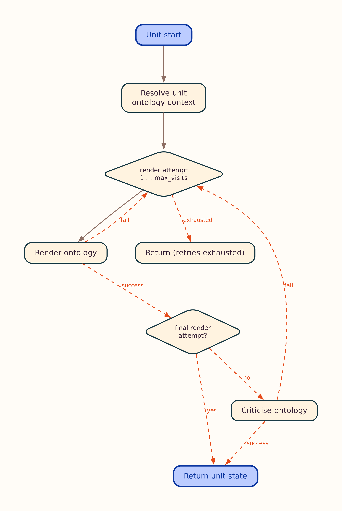
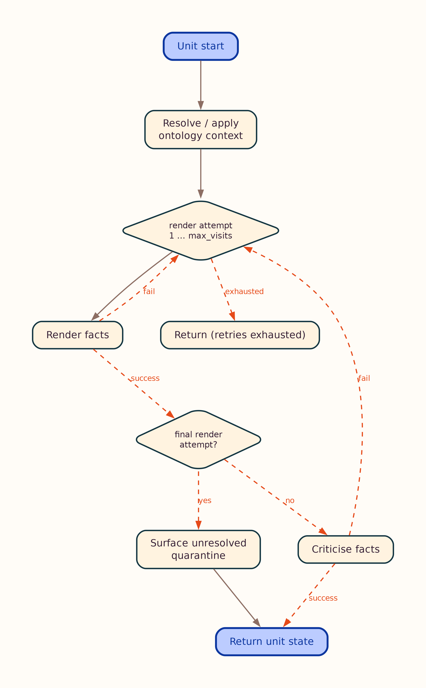
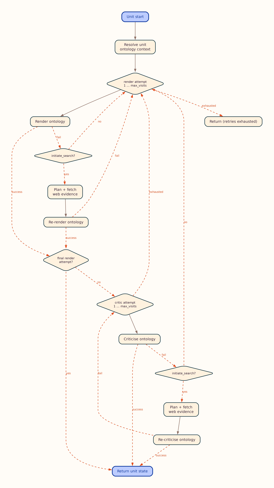
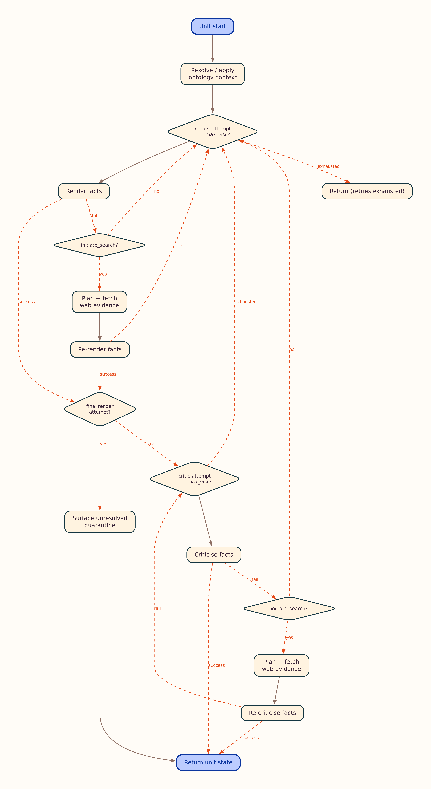

# OntoCast Workflow

This document describes the document processing pipeline implemented in `stategraph/create.py`. After changing optional nodes (e.g. Summarize Chunks), regenerate workflow diagrams with `uv run plot-graph`.

## Overview

OntoCast transforms input documents into RDF ontology and facts graphs through a **parallel map/reduce** pipeline:

1. **Document conversion** — PDF, DOCX, TXT, MD, or JSON → Markdown
2. **Chunking** — prepare pipeline (segment, tag, filter, size) into content units (`--head-chunks` limits count for testing). When `target_sections` and/or `summarize_sections` are set, tagging and section filter run inside **Chunk**; optional **Summarize Chunks** follows (see [Structured documents](concepts.md#structured-documents-optional))
3. **Ontology map/reduce** (when `render_mode` includes ontology):
   - Per-unit context assembly (catalog selection or vector retrieval)
   - Render/critic loops with optional web evidence
   - Global normalize (provenance split) → optional consolidate → structural check → consistency critic
4. **Facts map/reduce** (when `render_mode` includes facts):
   - Per-unit render/critic loops
   - Merge facts across units with entity disambiguation
5. **Serialize** — write to triple store and return Turtle in the API response

## Document-Level Graph

The LangGraph compiled by `create_agent_graph()` is rendered from the live workflow. Regenerate after graph changes:

```bash
uv run plot-graph
```

Outputs (under `docs/assets/`):

| File | Layout | Description |
|------|--------|-------------|
| [graph.png](../assets/graph.png) | Top-to-bottom | Full document pipeline (default) |
| [graph.lr.png](../assets/graph.lr.png) | Left-to-right | Same graph, landscape layout |
| [graph.svg](../assets/graph.svg) / [graph.lr.svg](../assets/graph.lr.svg) | Vector | Scalable versions |
| [graph.mmd](../../graph.mmd) | Mermaid source | Editable source at repo root |


<details>
<summary>Landscape layout (LR)</summary>


</details>

Nodes such as **Update Ontology** and **Render Facts** each run the per-unit atomic loop below (in parallel across content units).

## Per-Unit Atomic Loop

Inside `stategraph/atomic.py`, each content unit runs an independent **render → critic** loop. Ontology and facts share the same control flow; optional web-evidence branches are omitted in the default diagrams below (see `_evidence` variants).

Outputs (under `docs/assets/`):

| File | Layout | Description |
|------|--------|-------------|
| [ontology_loop.png](../assets/ontology_loop.png) | Top-to-bottom | Per-unit ontology loop (core path) |
| [ontology_loop.lr.png](../assets/ontology_loop.lr.png) | Left-to-right | Ontology loop, landscape layout |
| [ontology_loop.svg](../assets/ontology_loop.svg) / [ontology_loop.lr.svg](../assets/ontology_loop.lr.svg) | Vector | Scalable ontology loop |
| [ontology_loop.mmd](../assets/ontology_loop.mmd) | Mermaid source | Core ontology loop source |
| [ontology_loop_evidence.mmd](../assets/ontology_loop_evidence.mmd) | Mermaid source | Full ontology loop with web evidence |
| [facts_loop.png](../assets/facts_loop.png) | Top-to-bottom | Per-unit facts loop (core path) |
| [facts_loop.lr.png](../assets/facts_loop.lr.png) | Left-to-right | Facts loop, landscape layout |
| [facts_loop.svg](../assets/facts_loop.svg) / [facts_loop.lr.svg](../assets/facts_loop.lr.svg) | Vector | Scalable facts loop |
| [facts_loop.mmd](../assets/facts_loop.mmd) | Mermaid source | Core facts loop source |
| [facts_loop_evidence.mmd](../assets/facts_loop_evidence.mmd) | Mermaid source | Full facts loop with web evidence |





<details>
<summary>Full loops with optional web evidence</summary>





</details>

Notes:

- Core diagrams show the default path: render/critic retries without web search. When a node sets `initiate_search`, plan/fetch/retry branches apply — see `*_evidence.mmd` (and matching PNG/SVG).
- First render/critic pass always runs **without** web search; search runs only when the node sets `initiate_search`.
- On the **last allowed render attempt**, the critic is skipped (no further extract to critique). The facts loop also surfaces unresolved quarantined literals on that path.
- `/process_unit` runs this loop on a single unit via `unit_pipeline.py` (no chunking or document-level reduce).

Implementation: [`stategraph/atomic.py`](../../ontocast/stategraph/atomic.py).

## Stage Details

### 1. Document Input

- Accepts text, JSON (`text` field), or file uploads via `/process`
- Converts supported formats to Markdown while preserving structure

### 2. Chunking (and optional structured preprocessing)

Default path: **Convert** → **Chunk** → extraction.

When `target_sections` and/or `summarize_sections` are set on `/process` or CLI (`--target-sections`, `--summarize-sections`):

| Node | When | What it does |
|------|------|----------------|
| **Chunk** | Always | Prepare pipeline: Docling segments (or semantic fallback), optional tag/filter/size; builds `content_units` |
| **Summarize Chunks** | `summarize_sections` set | LLM compresses selected units (already tagged/filtered in Chunk); prompts use `extraction_text` |

- Section LLM tagging during Chunk uses **parallel** workers up to `PARALLEL_WORKERS`
- Use `--head-chunks N` on the CLI to process only the first N units (testing)
- Without section parameters, Chunk uses layout/simple sizing only (no tag/filter)

### 3. Per-Unit Ontology Loop

Each content unit runs an independent **ontology loop** (`stategraph/atomic.py`):


1. **Context assembly** — pick or retrieve ontology context for the unit:
   - LLM catalog selection (`selected_single_ontology`)
   - Qdrant vector ensemble (`selected_vector_search_ontology`)
   - Fixed catalog ontology (`fixed_single_ontology`)
2. **Render** — LLM emits `GraphUpdate` operations (Turtle or JSON-LD wire format)
3. **Critic** — validate structure; retry up to `max_visits` (config or per-request override)
4. **External evidence** (optional) — web search on retry when the node requests it

See [Ontology Context](ontology_context.md) and [User Instructions](user_instructions.md).

### 4. Ontology Reduce (Document Level)

After all units finish:

| Stage | Purpose |
|-------|---------|
| **Normalize** | Merge unit deltas; split RDF 1.2 provenance/reification into a side artifact |
| **Consolidate** (optional) | Single-pass refinement when `ENABLE_ONTOLOGY_CONSOLIDATION=true` |
| **Structural check** | Connectivity and schema validation |
| **Consistency critic** | Cross-unit ontology consistency |

Provenance triples (`prov:`, reification, chunk metadata) are kept in `ontology_provenance_artifact`, not in the working ontology graph passed to consolidation.

### 5. Per-Unit Facts Loop

When facts rendering is enabled, each unit runs a **facts loop** (render → critic, with optional web evidence), then **merge facts** applies cross-chunk entity disambiguation and aggregation.


Facts output uses the **`cd:` namespace** for text-derived instances; domain ontology IRIs are read-only schema and pre-declared reference individuals (see [Facts extraction model](concepts.md#facts-extraction-model)). Optional `facts_user_instruction` adds focus on top of these built-in guidelines.

### 6. Output

- Ontology and facts serialized to the configured triple store
- API returns Turtle (optionally with `strip_provenance=true` to omit reification scaffolding)
- Budget summary logged (LLM calls, cache hits, characters, triple counts)

## Configuration

| Setting / parameter | Effect |
|---------------------|--------|
| `RENDER_MODE` | `ontology`, `facts`, or `ontology_and_facts` |
| `PARALLEL_WORKERS` | Max concurrent unit workers |
| `LLM_MAX_INFLIGHT` | Max concurrent provider LLM requests (shared across units) |
| `MAX_CONCURRENT_PROCESSES` | Optional cap on simultaneous `/process` pipelines |
| `MAX_VISITS` / `max_visits` | Render/critic retry budget per loop |
| `ENABLE_ONTOLOGY_CONSOLIDATION` | Optional post-normalization consolidation |
| `ONTOLOGY_CONTEXT_MODE` | How per-unit ontology context is sourced |
| `LLM_GRAPH_FORMAT` | `turtle` or `jsonld` LLM wire encoding |
| `--head-chunks` | CLI limit on units processed |
| `target_sections` / `summarize_sections` / `summary_max_sentences` | Per-request structured-document preprocessing (not env vars) |

Full reference: [Configuration System](configuration.md).

## Best Practices

1. **Start with defaults** — `MAX_VISITS=1`, `ontology_and_facts`, consolidation off; tune after inspecting output.
2. **Use `--head-chunks`** for large documents during development.
3. **Monitor budget summaries** to estimate LLM cost at scale.
4. **Provide seed ontologies** in `ONTOCAST_ONTOLOGY_DIRECTORY` for catalog selection modes.
5. **Enable vector mode** only when Qdrant and embeddings are configured.

## Next Steps

- [Core Concepts](concepts.md) — GraphUpdate, provenance, disambiguation
- [API Endpoints](api.md) — `/process`, `/process_unit`, parameters
- [API Reference](../reference/onto/state.md) — `AgentState` and workflow types
